# MJava编译器词法及语法分析功能的设计与实现

本项目为《编译原理》课程设计，MJava是一种类Java的简易编程语言。在给定的词法规则及语法规则下，利用DFA完成该编译器词法分析功能的设计与实现，基于上下文无关文法设计出抽象语法树，采用递归下降算法实现该编译器的语法分析功能。

##### MJava词法分析的DFA

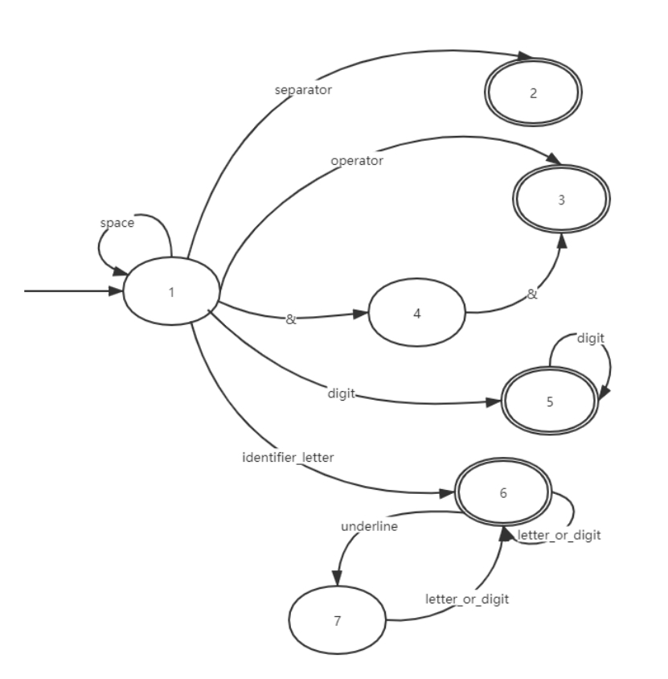

##### MJava语法分析抽象语法树结构

###### Goal-> MainClass { ClassDeclaration } EOF

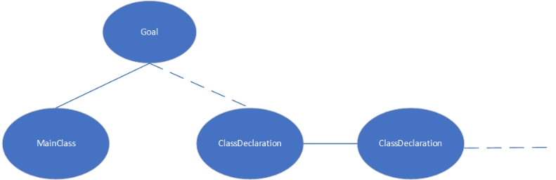 

###### MainClass->"class" Identifier "{" "public" "static" "void" "main" "(" "String" "[" "]" Identifier ")" "{" Statement "}" "}"

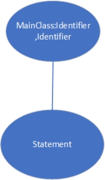 

###### ClassDeclaration->"class" Identifier [ "extends" Identifier ] "{" { VarDeclaration } { MethodDeclaration } "}"

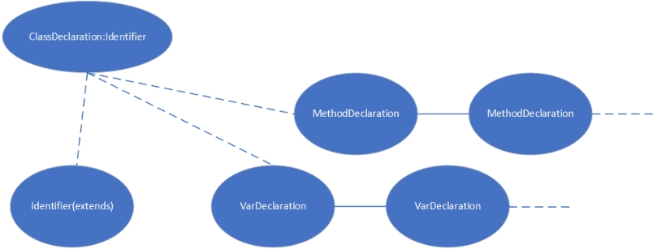 

###### VarDeclaration ->Type Identifier ";"

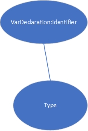 

###### MethodDeclaration->"public" Type Identifier "(" [ Type Identifier { "," Type Identifier } ] ")" "{" { VarDeclaration } { Statement } "return" Expression ";" "}"

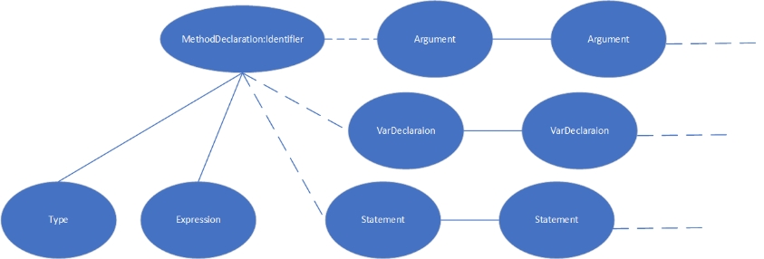 

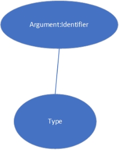 

###### Type->"int" "[" "]"|"boolean"|"int"| Identifier

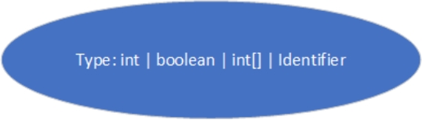 

###### Statement->"{" { Statement } "}"

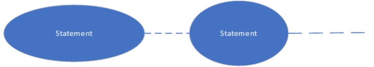 

###### Statement->"if" "(" Expression ")" Statement "else" Statement 

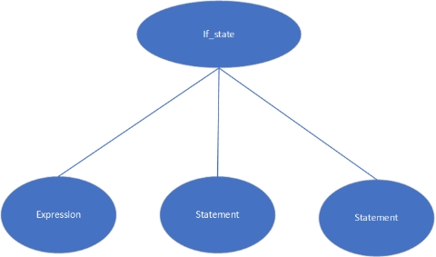 

###### Statement->"while" "(" Expression ")" Statement 

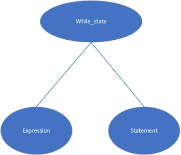 

###### Statement->"System.out.println" "(" Expression ")" ";"

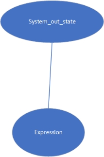 

###### Statement-> Identifier "=" Expression ";"

###### Statement-> Identifier "[" Expression "]" "=" Expression ";"

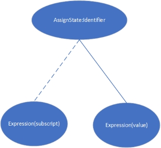 

###### Expression-> Expression "[" Expression "]"

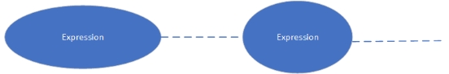 

###### Expression-> Expression  ( "&&" | "<" | "+" | "-" | "" ) Expression 

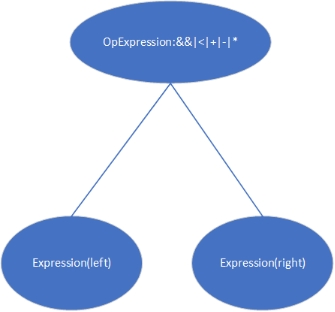 

###### Expression-> Expression "[" Expression "]"

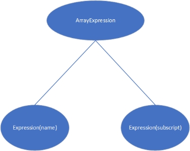 

###### Expression-> Expression "." "length"

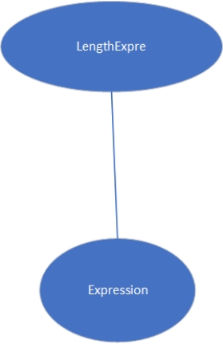 

###### Expression-> Expression "." Identifier "(" [ Expression { "," Expression } ] ")"

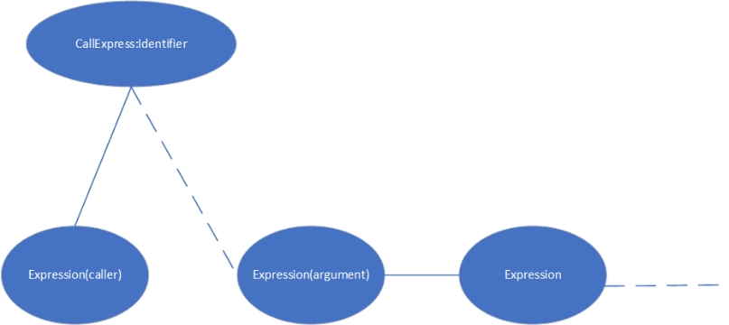 

###### Expression-> IntegerLiteral |"true"|"false"| Identifier |"this"

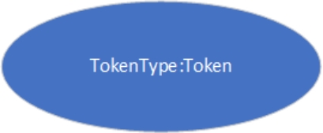 

 

###### Expression->"new" "int" "[" Expression "]"

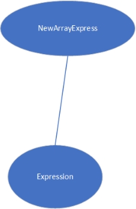 

###### Expression->"new" Identifier "(" ")"

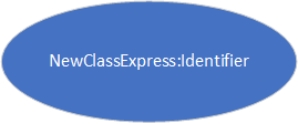 

###### Expression-> "!" Expression 

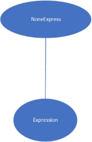 

###### Expression->"(" Expression ")"

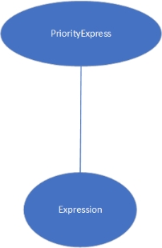 
